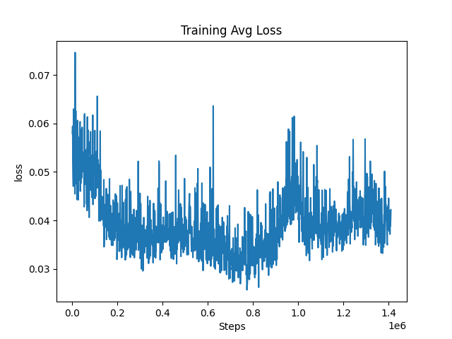
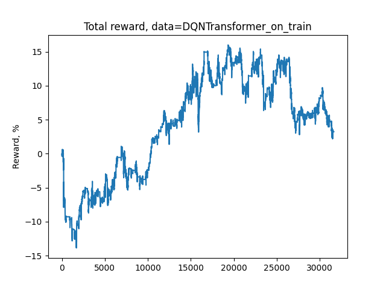
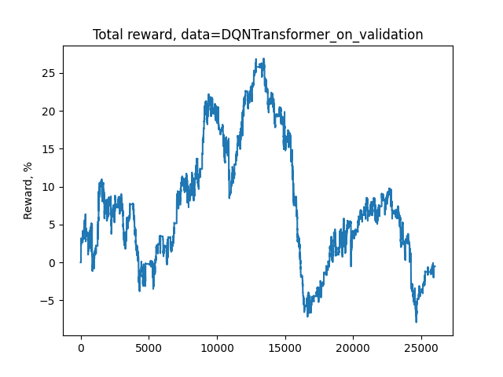

# Trading_RL_agent_with_transformers
An RL agent that can trade using **Deep Q-Network** (DQN) and a **decoder-only Transformer** trained on **time series** data

## Introduction

Welcome to the **Trading RL Agent with Transformers** project! This project was built on top of the great work of **[Shmuma](https://github.com/shmuma)
**. It is an implementation of a Reinforcement Learning (RL) agent designed for trading financial markets, leveraging the power of Transformer models. The goal of this project is to explore the potential of combining RL with Transformer architectures to create a robust and adaptive trading agent.

The agent is trained to make trading decisions (e.g., buy, sell, hold) based on historical market data, with the aim of maximizing rewards. The Transformer model is used to capture complex temporal dependencies and patterns in the market data.

In the original work of the author, two approaches were used: a simple **feed-forward** network and a **convolution-based** network, both followed by **Dueling DQN**, **Double DQN**, and **two-step Bellman unrolling**. In this project, we introduce a third approach where we use a **decoder-only Transformer** to capture attention, as this has become a prominent approach in **time series forecasting**.

## Training

### Model Architecture
We chose to use a **masked decoder-only Transformer** to ensure the model does not cheat by looking at future data. This masking mechanism restricts the model to only use past and present data when making predictions, which is crucial for realistic trading scenarios. Additionally, we employ **sinusoidal positional encoding** to maintain the order of the data, as Transformers do not inherently understand sequence order.

To balance model performance and hardware constraints, we set the **bar count** (sequence length passed to the Transformer) to **150**, which corresponds to **2.5 hours of data**. This sequence length was chosen as a compromise between capturing sufficient historical context and staying within the limits of our hardware capabilities.
### Train
To start training, run the following command:

```bash
python train_model_transformers.py --data data/YNDX_160101_161231.csv  -r run --dev cuda
```


## Evaluation
After training the agent, we pick the best model at minimum loss at step 850k. After this point, the model starts to overfit to the training data. Further details and logs can be found in the runs folder.




### Real-World Scenario
To evaluate the agent in a real-world scenario, we start a trading session for our model. First, we evaluate it on the training data:

```bash
python run_model.py -d data/YNDX_150101_151231.csv -m saves/model.data -n transformers_on_validation --type transformers
```


Then, we evaluate it on the validation data:



We can see that the model is performing well on both the training and validation data, with room for further improvement. Additionally, it is important to note that a broker commission of **0.1%** is applied on both buy and sell actions, as set by the author, to mimic real-world trading scenarios.


## Conclusion
This project demonstrates the potential of combining Reinforcement Learning with Transformer models for trading applications. By leveraging the strengths of both RL and Transformers, the agent can learn complex trading strategies and adapt to changing market conditions. 


Happy trading! 🚀📈
